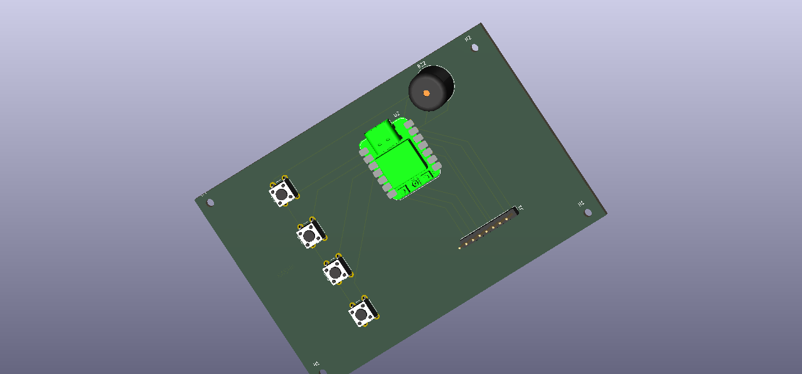

# BLARE — ESP32-C3 Alarm Clock

A compact, custom-built alarm clock based on the **ESP32-C3**, designed and developed from scratch with a custom PCB, firmware, and 3D-printed enclosure.

## 📸 Project Overview

BLARE is a simple standalone alarm clock built around an ESP32-C3 microcontroller.

The project includes:

* Custom PCB
* ESP32-C3 microcontroller
* Physical control buttons
* Buzzer/alarm output
* Custom 3D-printed enclosure
* Custom Arduino firmware
* Manufacturing-ready PCB Gerber files

## ✨ Features

* ⏰ Digital alarm clock functionality
* 🔘 Physical buttons for control
* 🔊 Buzzer alarm
* ⚡ ESP32-C3 based controller
* 🔋 Designed for low-power operation
* 🧩 Custom PCB
* 🖨️ Custom 3D-printed two-part enclosure
* 💻 Open firmware
* 🛠️ Manufacturing files included

## 🧠 Hardware

The main controller is an **ESP32-C3** development board.

### Main Components

| Component            | Quantity | Purpose                |
| -------------------- | -------: | ---------------------- |
| ESP32-C3             |        1 | Main microcontroller   |
| Push Buttons         |        4 | User controls          |
| Buzzer               |        1 | Alarm sound            |
| PCB                  |        1 | Main circuit           |
| 3D Printed Enclosure |        1 | Protection and housing |

## 🔌 PCB

The PCB was designed in **KiCad**.

The repository contains:

* KiCad schematic
* KiCad PCB layout
* KiCad project
* Manufacturing Gerbers
* Drill/manufacturing job information

### PCB Design



## 🖨️ Enclosure

The enclosure was designed as a **two-part 3D-printed case**:

1. Bottom
2. Top / Cover

The complete enclosure files are available in the `Production/` directory.

The CAD directory contains the complete assembled clock model in STEP format.

## 💻 Firmware

The firmware is written using the **Arduino framework** for ESP32-C3.

Source code:

`Firmware/firware.ino`

The firmware handles:

* Alarm configuration
* Button input
* Time/alarm logic
* Buzzer control
* ESP32-C3 hardware control

## 📁 Repository Structure

```text
dazzy-alaram/
│
├── CAD/
│   └── dazzy-alaram.STEP
│
├── PCB/
│   ├── dazzy-alaram.kicad_pro
│   ├── dazzy-alaram.kicad_sch
│   └── dazzy-alaram.kicad_pcb
│
├── Firmware/
│   └── firware.ino
│
├── Production/
│   ├── gerbers.zip
│   ├── Bottom.STEP
│   └── Top.STEP
│
└── README.md
```

## 🧰 Tools Used

* **Arduino IDE** — firmware development
* **KiCad** — schematic and PCB design
* **ESP32-C3** — microcontroller
* **3D CAD software** — enclosure design
* **3D printer** — enclosure manufacturing

## 📦 Bill of Materials (BOM)

| Component            |    Quantity |
| -------------------- | ----------: |
| ESP32-C3 board       |           1 |
| Push buttons         |           4 |
| Buzzer               |           1 |
| PCB                  |           1 |
| Wires/connectors     | As required |
| 3D-printed enclosure |           1 |

## 🚀 Building the Project

### 1. Hardware

Assemble the components according to the KiCad schematic.

### 2. PCB

The production-ready Gerber archive is located at:

```text
Production/gerbers.zip
```

These files can be supplied to a PCB manufacturer.

### 3. Firmware

Open the Arduino firmware:

```text
Firmware/firware.ino
```

Select the appropriate ESP32-C3 board in Arduino IDE and upload the firmware.

### 4. Enclosure

Print:

```text
Production/Bottom.STEP
Production/Top.STEP
```

Assemble the two parts around the completed electronics.

## 📐 Design Considerations

The enclosure was designed with approximately **0.2 mm or greater clearance** where printed parts need to fit together.

The PCB should be checked using KiCad's Design Rules Checker (DRC) before manufacturing.

## 🔧 Project Status

**Status: Prototype / Submission Ready**

The project includes the firmware, PCB design, manufacturing Gerbers, CAD model, and enclosure files required to reproduce the clock.

## 📜 License

This project is open source. You are free to study, modify, and build upon the design.
